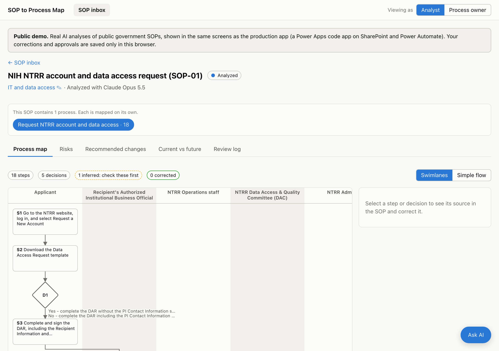
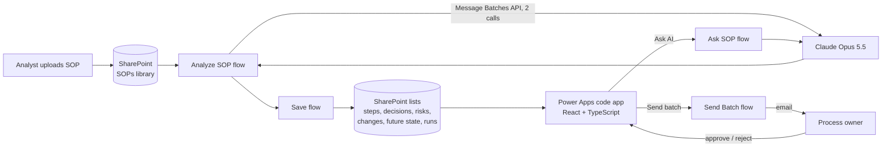

# SOP to Process Map

Converts written standard operating procedures (SOPs) into reviewed process maps, plain-language risks, and
prioritized improvement recommendations, with a human approval step for every change.

The application is a Power Apps code app (React, TypeScript) on SharePoint and Power Automate. Analysis is performed by
Claude Opus 5.5 through the Anthropic API. The app was built with Claude Code and Microsoft's Power Platform plugins.

**[Live demo](https://mkourouma53.github.io/sop-process-map/)** · 10 public SOPs across ten industries · no sign-in
required; changes are stored only in the browser



## Features

- **Process maps.** Each SOP is split into its separate processes (the Navy purchase card instruction contains 16).
  Maps render as vertical swimlanes or a simple flow. Every step links to its source section and quote, and inferred
  steps are flagged for review.
- **Risks.** Each risk states what could go wrong, the cause (with SOP citations), the impact on the process, figures
  counted from the SOP, a severity rationale, and the recommended fix.
- **Recommended changes.** Each change shows the current step, the proposed change, implementation steps in
  Microsoft 365, estimated impact, and the risks it resolves, scored by value and effort.
- **Review workflow.** An analyst recommends or drops each change and sends batches to the process owner. The owner
  receives one email per batch and approves or rejects each change in the app; the owner's decision is final.
  Every batch and decision is recorded in the review log.
- **Current vs. future state.** Side-by-side maps showing either approved changes only or all proposed changes.
- **Ask AI.** A sidebar on every screen answers questions from the SOP and its analysis, with page citations.

## Impact

- **4.4× faster to a process map.** The AI mapped three SOPs in 34 minutes of processing against 149 minutes by
  hand (3.5× to 5.3× per SOP), and that time also covers risks, recommended changes, and the future state.
- **More complete.** 193 steps mapped against 90 in the manual maps, with every additional step confirmed in the
  SOP text.
- **A shorter review cycle.** Analysts review a cited map instead of building one, and process owners approve or
  reject each change in the app instead of over email.

Full comparison and adoption case: [BUSINESS_CASE.md](BUSINESS_CASE.md#does-it-save-time).

## Evaluation

The pipeline is evaluated against reference process maps for three SOPs (90 steps, 23 decisions), built before any
pipeline output was reviewed. An LLM judge matches AI steps and decisions to the reference maps, and a grounding check
reads the source SOP for every AI step without a match.

| Metric | v1 | v2 | **v3 (current)** |
|---|---|---|---|
| Step recall | 76% | 92% | **96%** |
| AI steps not supported by the SOP | 0 | 2 | **0 of 193** |
| Decision accuracy | 30% | 57% | **65%** |
| Cost per SOP (standard / batch) | $0.98 | $1.51 | **$1.86 / ~$0.93** |

Precision against the reference maps is 45% in v3 because the model maps more of each SOP than the references cover;
the grounding check found no unsupported steps among them. Full results: [evals/results/COMPARISON.md](evals/results/COMPARISON.md).
Changes between versions are documented in the [failure log](docs/FAILURE_LOG.md).

## Architecture



1. An uploaded SOP (PDF or Word) triggers the **Analyze SOP** flow, which converts Word files to PDF and sends the
   document to Claude in two calls through the Message Batches API: the current-state map, then risks, recommended
   changes, and the future state. Structured outputs enforce a versioned JSON schema.
2. The **Save SOP Analysis** flow writes the results to SharePoint lists, replacing any previous analysis of the SOP,
   and logs tokens, duration, and cost.
3. The code app reads and updates the lists through the SharePoint connector. Calls to Claude from the app go through
   Power Automate flows; the API key is stored in a Power Platform environment variable and never reaches the browser.

Design decisions and trade-offs are documented in [DECISIONS.md](DECISIONS.md). The problem statement, measured
results, and rollout requirements are in [BUSINESS_CASE.md](BUSINESS_CASE.md).

## Key findings

- **SOPs scatter their processes.** The FCC directive describes its purchase process across three sections, and a
  rule in one section gates a step in another.
- **One SOP contains many processes,** and they do not align with its sections.
- **SOPs contradict themselves.** The Navy instruction assigns one step both a 5- and a 10-business-day deadline;
  the analysis flags these as conflicting-rule risks.
- **Precision alone misleads.** A grounding check separates invented steps from steps the reference maps omitted.

Details in [docs/FINDINGS.md](docs/FINDINGS.md).

## Repository structure

| Path | Contents |
|---|---|
| [`app/`](app) | Power Apps code app (React, TypeScript, Vite). `VITE_DEMO=1` builds the public demo from saved results. |
| [`prompts/`](prompts) | Versioned prompts and JSON schemas (v1–v3) and the Ask AI system prompt |
| [`evals/`](evals) | Test SOPs, reference maps, analysis and scoring scripts (LLM judge and grounding check), results |
| [`flows/`](flows) | Power Automate flow definitions, generated by [`scripts/build_flows.py`](scripts/build_flows.py) |
| [`scripts/`](scripts) | SharePoint provisioning, Dataverse solution deployment, demo data builder |
| [`docs/`](docs) | Findings, failure log, screenshots |

## Getting started

Run the evaluation:

```bash
python3 -m venv .venv && .venv/bin/pip install -r requirements.txt
echo "ANTHROPIC_API_KEY=your-key" > .env
.venv/bin/python evals/analyze.py --prompt v3 --only nih
.venv/bin/python evals/score.py --prompt v3
```

Run the demo locally:

```bash
cd app && npm install && VITE_DEMO=1 npx vite
```

## Test documents

Public SOPs from government, defense, financial services, healthcare, manufacturing, life sciences, HR, IT,
utilities, and local government ([list and sources](evals/sops/README.md)). Federal documents are public domain and
included; state and municipal documents are linked rather than redistributed.

## License

[MIT](LICENSE)
